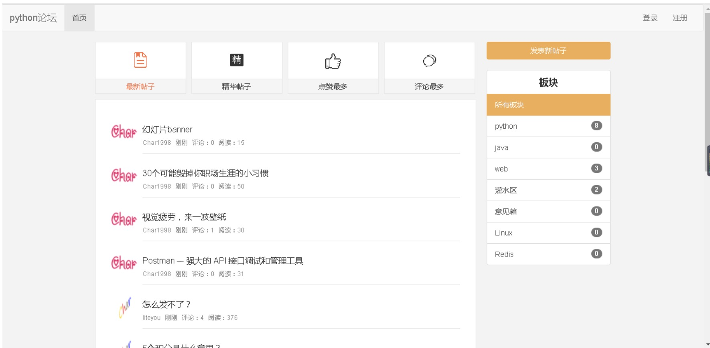
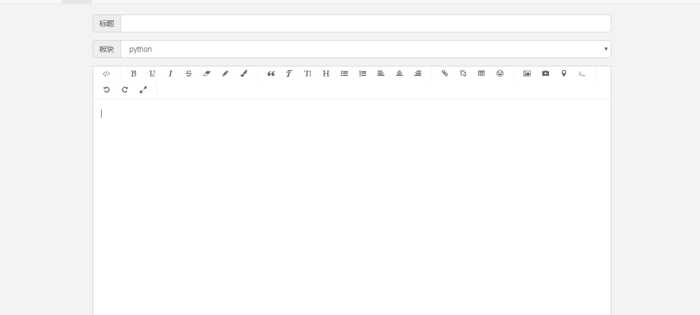
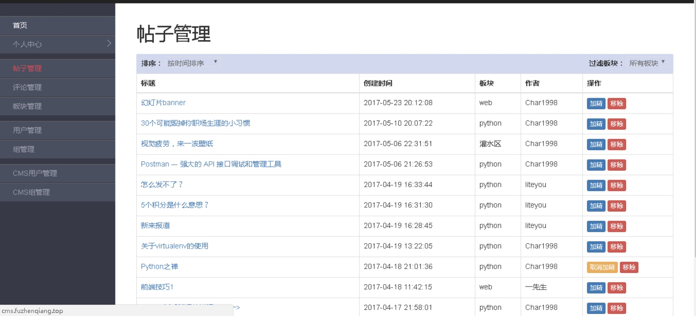

# Flask BBS项目

新入职后端工程师所需要完成的training项目。


## 开始

1. git clone 这个项目
```
    git clone git@e.coding.net:mzteam/backend-training.git
```

2. 创建新分支
```
    git checkout -b 你的名字-feature-training
```

3. coding


## 部署
使用的[heroku](https://www.heroku.com/)来进行服务部署。
1. 先在官网注册账号
2. 下载[cli工具](https://devcenter.heroku.com/articles/getting-started-with-python?singlepage=true)
3. 登录
```
heroku login
```
4. 创建application，创建成功会返回一个url
```
 heroku create application_name
```
5. 增加remote，把上面返回的url替换下面的url
```
git remote add prod https://git.heroku.com/application_name.git
```
6. 设置环境变量
```
heroku config:set APP_SETTINGS=config.ProductionConfig --remote prod
```
7. 创建数据库，创建成功会往环境变量里面塞入数据库的信息，环境变量字段为：DATABASE_URL
```
heroku addons:create heroku-postgresql:hobby-dev --app application_name
```
8. 查看设置的环境变量
```
heroku config --app application_name
```
9. push代码到heroku，推送完成最后会有一个url，就是部署好之后的地址。
```
git push prod master
```
10. 更新数据库
```
heroku run python manage.py db upgrade --app application_name
```

更详情的命令，见[官网](https://devcenter.heroku.com/articles/getting-started-with-python?singlepage=true)

## 例子
Flask的[Demo](https://mzteam.coding.net/p/books-store/d/books-store/git)，已经在heroku上部署成功，有需要可以参考一下。


## 功能点

### 前台
1. 登录注册，不需要短信和邮箱验证
2. 发帖
3. 评论帖子
4. 回复评论
5. 首页，可以对帖子进行过滤和按时间、按评论量和按加精的方式进行排序。

### 后台
1. 用户系统，权限和分组。可以把某个用户分给某个权限，也可以把某个组分给某个权限。
2. 管理帖子，功能：加精，删除等。
3. 管理板块，功能：增删改查等。
4. 评论，功能：增删改查等。
5. 前台用户，功能：增删改查等。
6. CMS用户，功能：增删改查等。

上面是列的基本功能点，其他可以随意发挥。

### 注意点
* 前后端要分离
* 样式没要求


## 示意图
### 首页


### 发帖


### 后台



